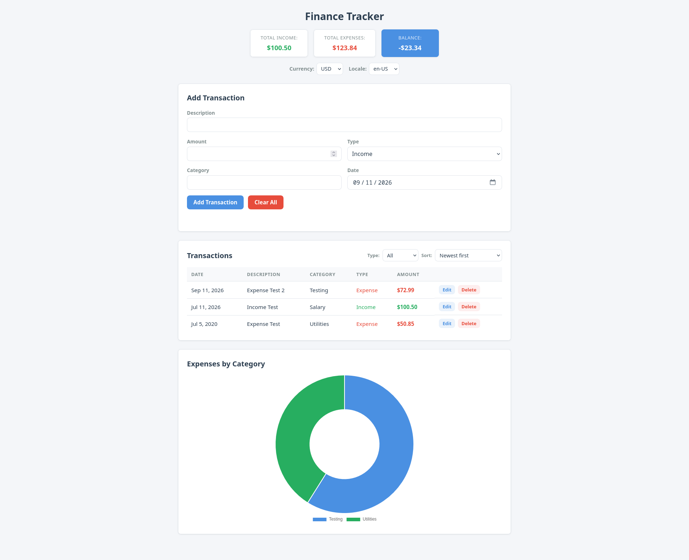

# Finance Tracker

Local-first, browser-only personal finance tracker. Add income and expense
transactions, see your balance at a glance, and explore spending patterns with
charts. No backend, no sign-up, and no data ever leaves your browser.

## Screenshot



## Features

- Add, edit, and delete income/expense transactions with categories and dates
- Live summary: total income, total expenses, and balance
- Filter by type and sort by date, amount, or description
- Expenses-by-category doughnut chart (Chart.js)
- Currency and locale display settings (8 currencies, 8 locales)
- Everything persists in `localStorage` - works offline

## Tech Stack

- Vanilla JavaScript (ES modules) - no framework
- Chart.js v4.5.1 (vendored, MIT)
- `localStorage` persistence
- Node's built-in test runner + ESLint 10

## Getting Started

```bash
npm install
npm start     # serves the app at http://localhost:3000
npm test      # runs the unit test suite (node --test)
npm run lint  # or npm run lint:fix
```